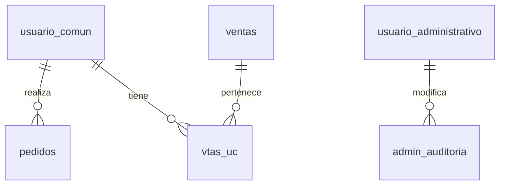

# Gestión administrativa relacionada con compradores

## Modelo de negocio

El panel `/admin` reúne datos de la base a través de endpoints protegidos. El administrador no utiliza credenciales PostgreSQL desde el navegador.

- `usuario_comun.uc_id` identifica al comprador, independientemente de cambios de correo.
- `pedidos.uc_id` referencia esa cuenta y conserva fecha, total, moneda, productos/precios al comprar y preferencia de Mercado Pago.
- `ventas` conserva las ventas registradas por el sistema existente; `vtas_uc` las relaciona con `usuario_comun`.
- `admin_auditoria` relaciona cada edición con el administrador, entidad, registro, fecha y valores anteriores/nuevos.

No se presentan pedidos pendientes como ventas. Los pedidos anteriores a esta implementación no existían en la base y no se reconstruyen artificialmente.

## Panel y hook

`useAdmin` mantiene autenticación separada del comprador. `Gestion.jsx` proporciona:

- Resumen de cuentas, pedidos, pendientes, ventas e importe de ventas registradas.
- Búsqueda de usuarios por nombre/correo y ficha con sus pedidos y ventas.
- Historial de pedidos con desglose de productos, estado y preferencia de pago.
- Historial de ventas con comprador y producto relacionados; ventas sin vínculo existente se muestran sin inventar un titular.
- Consulta y edición de viajes, paquetes, autos y excursiones.
- Edición de nombre, apellido y correo del comprador, conservando su ID y relaciones.
- Registro de cambios; nunca se devuelven hashes ni contraseñas de compradores.

Se conserva el alta de viajes y paquetes de la primera versión. Las listas muestran hasta 200 registros recientes; la búsqueda de usuarios se hace en SQL. No hay borrado físico desde este panel para conservar historiales. La edición no cambia IDs ni reasigna ventas a otro usuario.

## Contratos HTTP

Todos estos endpoints requieren token administrativo:

- `GET /admin/resumen`
- `GET /admin/usuarios?q=texto`
- `GET /admin/usuarios/{id}` devuelve `usuario`, `pedidos`, `ventas`.
- `GET /admin/pedidos?usuario_id=...`
- `GET /admin/ventas?usuario_id=...`
- `GET /admin/catalogo/{viajes|paquetes|autos|excursiones}`
- `PATCH /admin/datos/{entidad}/{id}` recibe campos permitidos, valida y audita en una misma transacción.
- `GET /admin/auditoria`

## Conexión del checkout con la cuenta

`POST /clientes/sesion` valida contraseña bcrypt y entrega token de comprador. No puede usarse como token administrativo. El frontend lo mantiene en sessionStorage y lo envía a `/carrito`. El comprador debe volver a iniciar sesión tras actualizar esta versión. Su logout revoca ese token.

`POST /carrito` recibe IDs, tipo (`viaje` o `paquete`) y cantidades. La identidad se obtiene del token; el correo enviado por el cliente no determina al titular. Los nombres, precios y disponibilidad se consultan en SQL. El backend registra el pedido antes de contactar a Mercado Pago y envía su UUID como `external_reference`.

Estados: `creado` → `pendiente_pago` cuando Mercado Pago entrega la preferencia; `error_checkout` cuando no se logra iniciar el checkout. Un error de comunicación no prueba rechazo de un pago. Un proceso interrumpido puede dejar un pedido `creado` para investigación.

`GET /clientes/mis-pedidos` devuelve únicamente los pedidos del comprador autenticado. Las sesiones de comprador y administrador actuales son locales al proceso, duran una hora y se invalidan al reiniciar; para múltiples workers/serverless hace falta un almacén compartido.

**Límite de pagos:** esta entrega registra pedidos y consulta ventas existentes; no implementa webhook ni conciliación de pagos aprobados. Abrir o volver del checkout no crea una venta. Falta verificar pagos con Mercado Pago y, en una transacción idempotente, registrar la venta, relacionarla al pedido/usuario y descontar cupos. La disponibilidad se comprueba al iniciar el checkout, pero no se reserva stock durante el pago. El alta/cancelación antigua de ventas conserva su lógica previa y requiere revisión transaccional antes de producción.

## Base de datos

Migración aditiva: `backend/migrations/001_gestion.sql`. Crea pedidos y auditoría con claves foráneas e índice por usuario/fecha, sin borrar tablas ni datos existentes. RLS habilitado, sin políticas públicas: solo el backend con su conexión privilegiada las utiliza. Fue aplicada al proyecto configurado en esta sesión.

Para otro entorno, aplicar el SQL sobre la base correcta antes de iniciar esta versión. Se puede ejecutar nuevamente sin duplicar tablas. No modifica ni crea cuentas administrativas; usar `crear_admin.py` si hace falta una.

## Validación

- Compilación del frontend.
- Pruebas automatizadas de permisos, campos editables, valores inválidos, identidad del pedido, precio tomado de catálogo y errores de stock/proveedor.
- Consultas reales de solo lectura del resumen, catálogos y ficha en Supabase, sin volcar datos personales.
- No se ejecutan pagos ni correos de prueba automáticamente; no se confirma una venta ficticia.
- Pendiente la prueba visual con cuenta administrativa y recorrido completo de compra. La gestión de devoluciones, permisos granulares y reportes exportables queda fuera de esta entrega.
